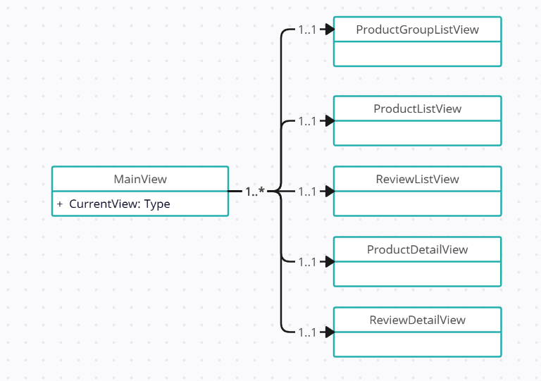

# Navigation
## Preparations
1) Open Microsoft SqlServer Management Studio
2) Connect to .\SqlExpress using Windows Authentication. Enable Trust Server Certificate
3) On right click on Databases and select Import Data-tier Application
4) Import from Local Disk: "D:\Exercises\Assets\ProductCatalog.bacpac"
5) Complete the wizard accepting all default values
## Introduction
We have a WPF application that displays product information. The application start off with an overview of clickable product groups. Each product group navigates to an overview of products in that product group and each product navigates to the details of that product.
The application starts with MainWindow which only has a placeholder (see MainViewModel.CurrentView) for other views, starting with ProductGroupListView.
Every time a navigation to another view occur the placeholder a new view will be assigned to CurrentView. Each view need to know where to go to next and where it came from.

Besides the MainWindow (MainViewModel) a bunch of view component exists (See diagram 1):
* ProductGroupListView (default). To show an overview of all product groups
* ProductListView. To show a list of products in the selected product group
* ReviewListView. A list of reviews of the selected product
* ProductDetailView. The details of a product like specifications, price
* ReviewDetailView. Shows an editable detail of a review.

From within Views the user can navigate to other views. For that the MainView needs to know which view.

### Exercise 1
As a solution it might be tempting extend the views with references to their navigational views, however that will get messy pretty soon.
What design pattern would you recommend and why?
### Exercise 2
Sketch a class diagram for this particular application (for time sake, consider only the relevant information)
### Exercise 3 (Optional. If time permits)
Open [Starter/Application.sln](/Starter/Application.sln).
Try to implement the design pattern.
You'll find several TODO's in the existing code where navigation should occur.
