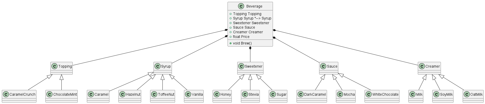

# Making Coffee
## Introduction
For a fictive company ACMEBucks we've got an assignment to create software for a beverage machine.
They offer three basic beverages, HotCoffee, HotTea and Oleato. More will follow in future. 
All the drinks have several ingredients and additions. We came up with the current solution. 

It works but has serious issues.
### Exercise 1
What are the issues with the current implementation?
### Exercise 2
What design pattern would you recommend instead and why?
### Exercise 3
Sketch a class diagram for this program based on your recommended pattern.
### Exercise 4 (optional. If time permits)
Open [Starter/Exercise5.sln](/Starter/Exercise5.sln).
Try to implement the design pattern.

